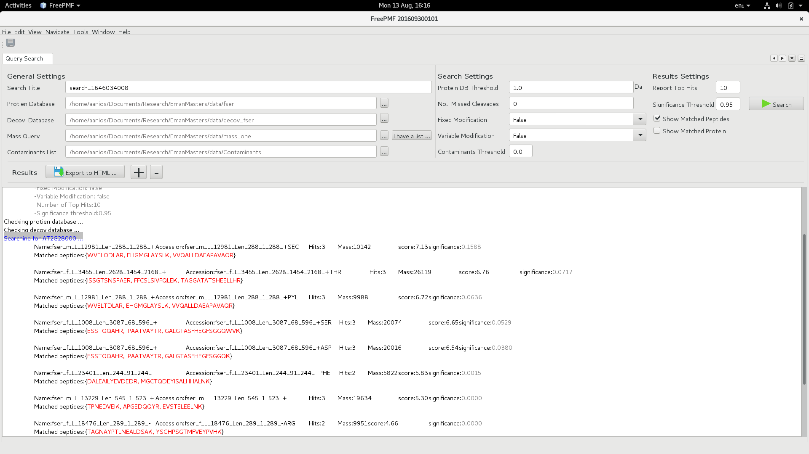

# Peptide_Mass_Fingerprting_App

## Peptide Mass Fingerprinting Tool Using Mass Spectrum Generated By MALDI-TOF:

Protein identification using Mass Spectrometry (MS) is essential in the study of proteomics and one of the most popular methods for protein identification using MS data. This project provides a free computational tool for protein identification using PMF data. It introduces a new scoring method to
help in identifying the correct protein. 

A friendly graphical user interface is provided to allow file and project management. In addition, the application works with single or multiple query files to support different work scales.

Before matching MS masses and database masses, and calculating the scores, there are steps that affect the results and should be implemetnted in advance for both MS masses and database masses: 

- ***Removing Contaminants from MS Masses.***
- ***Digestion:*** Digestion is the task of cutting the protein into peptides by using a specific enzyme.

- ***Mass Calculation:*** The weight of each peptide depends on its amino acid composition. When computing the mass for a peptide (based on the digestion), the sum of weights for the amino acids of the peptide is calculated.

- ***Handling Ambiguity in Database Proteins:*** In many cases, database sequences include symbols that do not encode amino acids, resulting in ambiguity in the protein sequence.

